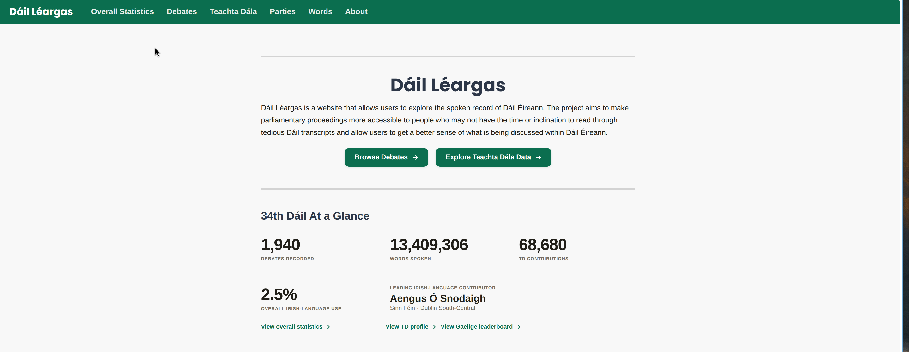

# Dáil Léargas

Dáil Léargas is web application I created to make the spoken record of Dáil Éireann easier to navigate, analyse, and interpret. 

[View the website here!](https://dail-leargas.duckdns.org/)



## Setup

## Installation

To run the website locally:

1. Clone the repository and enter the project directory:

```bash
git clone https://github.com/Lucahollman/dail-leargas
cd dail-leargas
```

2. Install the project dependencies with uv

```bash
uv sync
```

3. Run the setup file

```bash
uv run python python/populator.py
```

- This setup file can at times take very long. To shorten this process, you can change the dates in api-query to target a shorter period of time. These dates can be found on line 52 and 53.

4. Start the website locally

```bash
uv run python run.py
```


